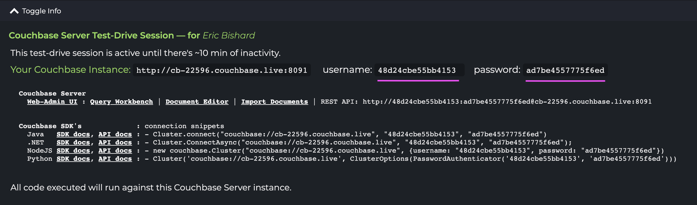

# Couchbase SDK Playground

We have launched a new project now available at [Couchbase.live](https://couchbase.live), helping developers learning Couchbase to explore the different SDKs for Java, NodeJS, .NET, and Python. You can currently try out code that utilizes the individual SDKs. This blog post will take you on a brief tour and get you running code against a live Couchbase Server container.

We have built this technology in the Go programming language on top of AWS, it's quick to spin up a Couchbase Server container complete with Web UI and start running code against our `travel-sample` dataset.

## Test-Drive

You can get started by browsing to [Couchbase.live](https://couchbase.live). If you try to run code immediately without starting a test-drive, your data will not be persisted from one execution to the next, so I suggest logging into Couchbase Live using the Start-Test Drive button.


Once you select to start a test drive, you can log in with a username and password. 


This gives you access to a Couchbase Server instance, code can be run in several of the preferred SDKs. Like earlier stated, a test-drive will ensure that data is persisted from one execution to the next.'



Try using the query tab to run N1QL queries


## An Quick Tour around the UI

Upon logging in, you will see info at the top of the screen specific to your current Couchbase Server instance. Let's use this information to log into the Web Admin.

> Note: This test-drive session is active until there's ~10 min of inactivity. If you do get logged out, you will be prompted to start a new test-drive and you can log right back in. Data will be lost from the last session.

If you click on the Web Admin UI link, you will be prompted to enter a username and password, **Your Couchbase Instance** will show the hashed values needed to log in (underlined in the screenshot above). These unique values will change from one test-drive to the nest.

Just copy the information over to the login screen and you will be redirected to the Couchbase Server Dashboard where you will see two sample buckets installed: `beer-sample` and `travel-sample`.


Available to you are the following services: **Query**, **Indexes**, **Search**, and **Views**. TAt this time **Analytics**, and **Eventing** are not available, but may be included in future versions of the tool.

Our prebuilt examples in the left-side navigation use the `travel-sample` data set, however; you can alter the code or create your data set to run code against on the bucket tab in the Web UI by clicking on **Add Bucket**. In this tutorial we will use the `travel-sample` dataset as the code is already set up to use it and each session is only ten minutes. There are currently no options for saving your data or examples, so it's merely a playground to experiment with. Given more interest in the project, this could be a feature we add.

## Trying out the NodeJS Examples

Let's walk through some examples and see what exactly we can do. After starting your session, click on the NodeJS **KV Get** example.


When you hit the **Run** button, a response will show up in the **Output** panel on the right side of the screen. This example will generate the following in the Output Panel:

    Result: 
    {
      cas: CbCas { '0': <Buffer 00 00 8b d7 55 19 48 16> },
      content: {
        callsign: 'MILE-AIR',
        country: 'United States',
        iata: 'Q5',
        icao: 'MLA',
        id: 10,
        name: '40-Mile Air',
        type: 'airline'
      }
    }

As we can see, we have retrieved one document with the key of `airline_10`, notice that if you change the key on line 20 to something else like: `airline_112` and **Run** again, a new result will show in the **Output**:

    Result: 
    {
      cas: CbCas { '0': <Buffer 00 00 94 d8 55 19 48 16> },
      content: {
        callsign: 'FLYSTAR',
        country: 'United Kingdom',
        iata: '5W',
        icao: 'AEU',
        id: 112,
        name: 'Astraeus',
        type: 'airline'
      }
    }

So we can update any of the examples with whatever code we want. This creates a nice playground experience to test out samples from our documentation and each SDK language will have the same example titles so that it is easy to see what the code looks like for each operation in one SDK compared to another.

## Examples Featuring N1QL

I love being able to just play around with N1QL and test my knowledge of the query language, if you select one of the **Query** examples like **Query Rows**, we can test out a N1QL query and explore the possibilities. Let's choose that example, **Run** it, and then update the N1QL statement to:

```SQL
SELECT RAW r.author
FROM \`travel-sample\` t
UNNEST reviews AS r
WHERE t.type = "hotel"
  AND r.ratings.Overall > 3 LIMIT 5;
```

From looking at the data in the Web UI, one can see that a hotel document had a nested array of reviews. Understanding how the **UNNEST** clause works, I can test out an idea around selecting an author's name for reviews of hotels where the **Overall** rating is greater than 4 (top reviews). You can get all sorts of good N1QL ideas from visiting our [N1QL Tutorial](https://query-tutorial.couchbase.com) and stepping through a few lessons (seen below).


## Persisting and Modifying Data

Although the test-drive session is only 10 minutes long, it still leaves plenty of time to get in there and explore and play with retrieving, changing documents and sub-documents. Let's see a few more examples of that.

After we start a test-drive, we can open up the Node JS **Sub-document Lookup** example which prints out the country of our airline with the key `airline_10`. We see that it is **"United States"**.

Next, we can open the **Sub-document Mutate** example which uses both the Lookup and Mutate methods. Together we can first run some code that mutates just one portion of a document (country field) and in the same example retrieves that sub-document value after the nutation and prints the new value: **"Canada"** (shown below).


We have many different potential uses for this technology and what you are seeing is just a preview of what this tool will grow to be. We have ideas from running documentation code samples to letting users build up their own favorite code snippets. But we need feedback and ideas from users to help us understand how a tool like this could help you. Feel free to reach out to us on Twitter, our DM's are always open and let us know what you think.

My name is Eric Bishard also know as [@httpJunkie](https://twitter.com/httpJunkie) on Twitter or you could reach out to our [@couchbaseDev](https://twitter.com/CouchbaseDev) account and ask us any questions you have related to developer experience at Couchbase.